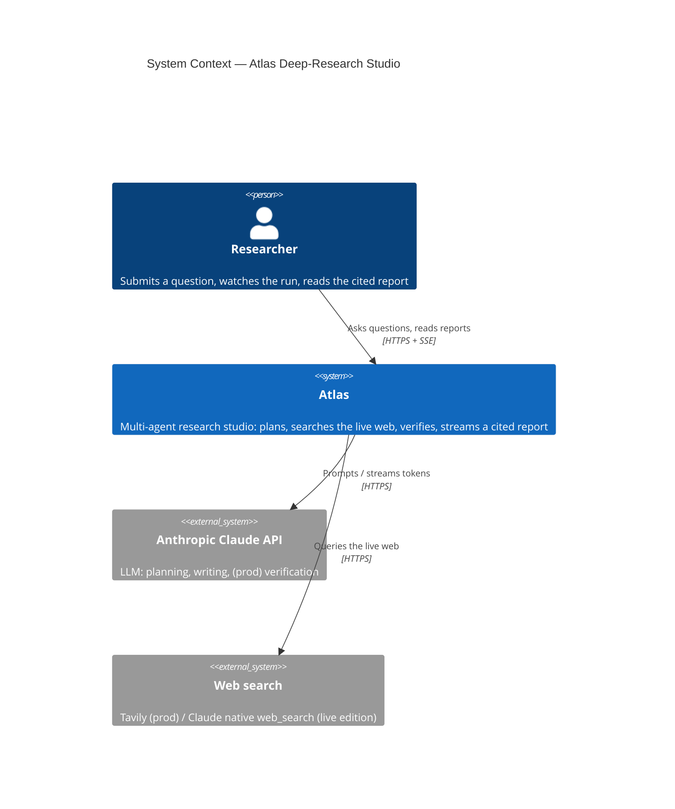
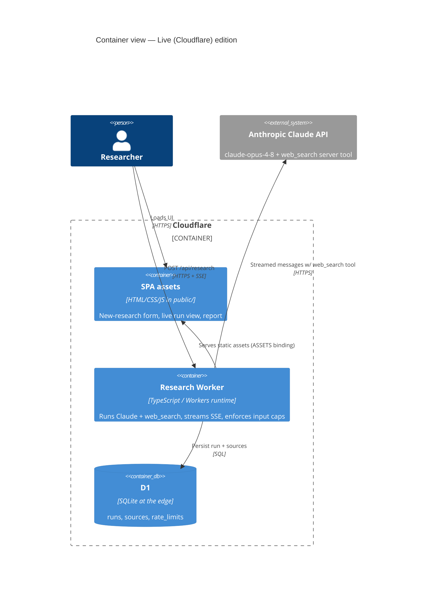
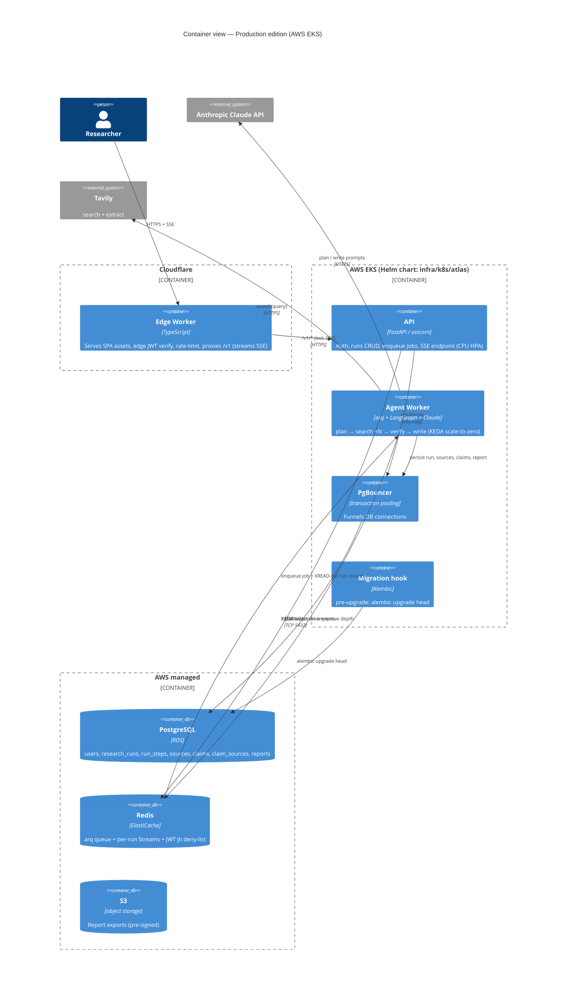
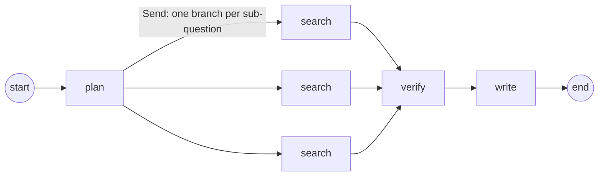
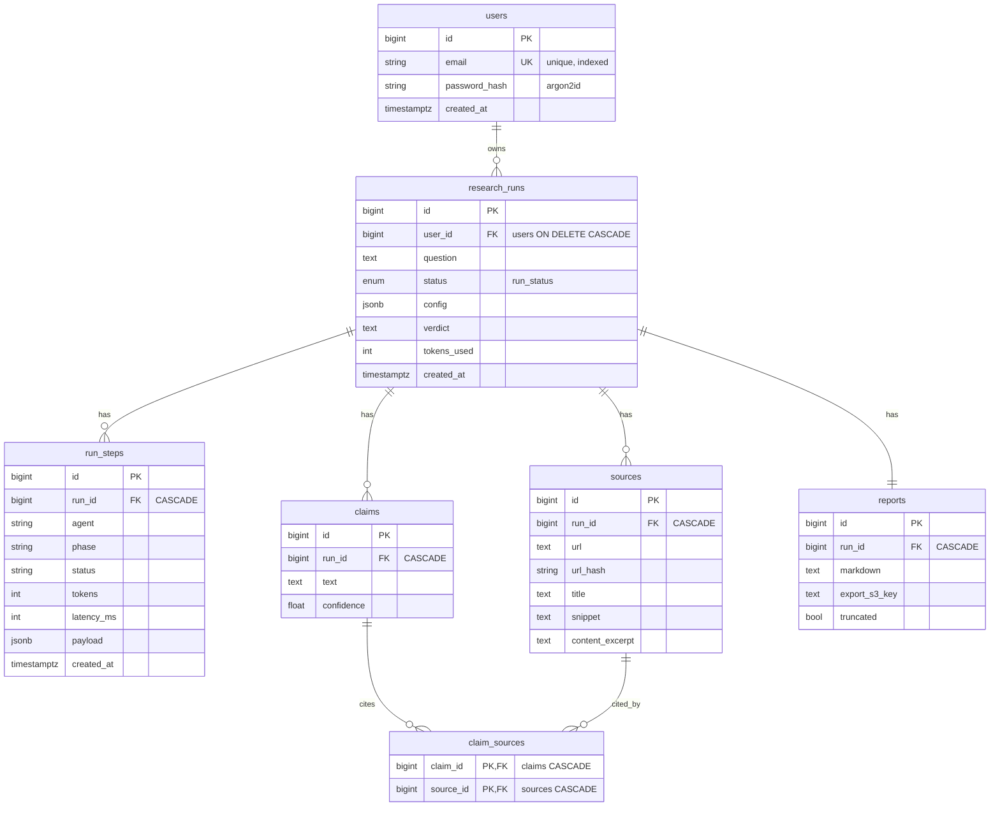

# Atlas — Architecture

This document describes Atlas using the [C4 model](https://c4model.com/): a **System Context**
view (the big picture), a **Container** view for each edition (the deployable/runnable pieces),
the **request/data-flow sequence** for "one question → cited report", and the **data model**.

Atlas exists in two editions that share one design:

- **Live (Cloudflare) edition** — a single Worker running Claude with native `web_search`, backed
  by D1. Source: [`apps/cloudflare/`](../apps/cloudflare/).
- **Production edition** — FastAPI + LangGraph agent workers on Kubernetes (AWS EKS), backed by
  PostgreSQL and Redis. Source: [`apps/api/`](../apps/api/), [`apps/web/`](../apps/web/),
  [`infra/`](../infra/).

---

## 1. System Context

Plain language: a person asks a research question. Atlas does the legwork — it searches the live
web through a search provider and reasons with a large language model (Claude) — and hands back a
written, cited report. Atlas owns the orchestration, persistence, and streaming; it depends on two
external services it does not run.



External dependencies the operator supplies keys for: **Anthropic** (`ANTHROPIC_API_KEY`) and, for
the production edition, **Tavily** (`TAVILY_API_KEY`). Without a Tavily key the production agent
falls back to a deterministic stub search provider so the full loop still runs offline.

---

## 2. Container view — Live (Cloudflare) edition

Everything runs in one Cloudflare Worker at the edge. The Worker serves the SPA static assets and,
on `/api/*`, runs the research agent: it calls Claude Opus 4.8 with the native `web_search` server
tool, streams progress and the report to the browser over SSE, and persists finished runs to D1.



Notable properties (from [`apps/cloudflare/src/index.ts`](../apps/cloudflare/src/index.ts)):

- **One streamed Claude call** with `tools: [{ type: "web_search", max_uses: 5 }]`; the Worker
  parses Anthropic SSE frames and re-emits its own `status` / `agent` / `source` / `token` / `done`
  events to the browser.
- **Untrusted-content hardening in the system prompt**: all `web_search` results are treated as
  data, never instructions (indirect prompt-injection defense — see [threat model](threat-model.md)).
- **Cost/abuse caps**: question length ≤ 500 chars, `max_uses: 5` searches, `max_tokens: 6000`;
  per-IP and global daily caps are scaffolded (`rate_limits` table + `PER_IP_DAILY` / `GLOBAL_DAILY`).
- **SSE-safe headers**: `text/event-stream`, `cache-control: no-cache, no-transform`,
  `x-accel-buffering: no`.

---

## 3. Container view — Production edition

Plain language: the browser talks to a Cloudflare Worker that serves the SPA and proxies API calls
to FastAPI on Kubernetes. The API writes to Postgres and drops a job on a Redis queue. A separate
fleet of agent workers (autoscaled by KEDA on queue depth) runs the LangGraph research graph,
streaming progress into a per-run Redis Stream that the API tails back to the browser over SSE.



Key design choices and where they live in code:

| Concern | Choice | Source |
|---|---|---|
| Streaming backbone | **Redis Streams** (replayable, `Last-Event-ID`), not pub/sub | [`runs/streaming.py`](../apps/api/src/atlas_api/runs/streaming.py) |
| Queue / workers | Redis + **arq**, `_job_id` idempotency, `allow_abort_jobs` | [`runs/router.py`](../apps/api/src/atlas_api/runs/router.py), [`worker.py`](../apps/api/src/atlas_api/worker.py) |
| Worker autoscaling | **KEDA** Redis scaler on `arq:queue` depth, scale-to-zero | [`worker-scaledobject.yaml`](../infra/k8s/atlas/templates/worker-scaledobject.yaml) |
| DB access | one `AsyncSession` per request; **PgBouncer** in front of RDS | [`db/engine.py`](../apps/api/src/atlas_api/db/engine.py), [`docker-compose.yml`](../docker-compose.yml) |
| Auth | app-level **JWT (RFC 8725)** + refresh rotation + Redis jti deny-list | [`auth/tokens.py`](../apps/api/src/atlas_api/auth/tokens.py) |
| Cancellation | Redis cancel flag checked between graph supersteps | [`runs/streaming.py`](../apps/api/src/atlas_api/runs/streaming.py), [`worker.py`](../apps/api/src/atlas_api/worker.py) |

### The agent graph (LangGraph)

The compiled graph in [`agents/graph.py`](../apps/api/src/atlas_api/agents/graph.py) is:



- **plan** — Claude decomposes the question into ≤ `max_subquestions` (default 4) focused
  sub-questions.
- **search ×N** — fanned out in parallel with LangGraph's `Send` API; each branch queries the
  `SearchProvider` (Tavily, or the deterministic stub) for ≤ `max_sources_per_q` (default 3) sources.
  Each searcher returns its own result so one failure doesn't abort the superstep.
- **verify** — current code does a deterministic claim-tracking pass (each retained source becomes a
  tracked, citable claim). The **LLM entailment check** described in the spec (cited source text
  must *support* the claim) is the documented-as-planned upgrade that plugs into this seam.
- **write** — Claude writes the cited Markdown report from the numbered sources.

The **critic / re-loop** node and structured-output/native-Citations grounding from the design spec
are planned, not yet in code. The worker streams `status` / `plan` / `source` / `report` events as
it advances; per-token streaming is implemented in the live Cloudflare edition.

---

## 4. Request / data flow — one question → cited report (production edition)

```mermaid
sequenceDiagram
    autonumber
    actor U as Browser (SPA)
    participant E as Cloudflare Worker (edge)
    participant A as FastAPI API
    participant DB as Postgres (via PgBouncer)
    participant R as Redis (queue + stream)
    participant W as Agent Worker (LangGraph)
    participant LLM as Claude + Tavily

    U->>E: POST /v1/runs { question } (JWT)
    E->>A: proxy POST /v1/runs
    A->>DB: INSERT research_runs (status=queued)
    A->>R: enqueue run_research_job (_job_id=run:<id>)
    A-->>U: 202 Accepted { run id }

    U->>E: GET /v1/runs/{id}/events (SSE, Last-Event-ID)
    E->>A: proxy SSE (stream, no buffering)
    A->>R: XREAD stream atlas:run:<id>:events (replay + tail)

    R-->>W: KEDA wakes a worker (queue depth > 0)
    W->>DB: status=planning
    W->>LLM: plan(question)
    W->>R: XADD status=planning, plan{subquestions}
    par parallel search (Send fan-out)
        W->>LLM: search(sub-question 1..N)
    end
    W->>R: XADD source events (deduped by URL)
    W->>R: XADD status=verifying
    W->>LLM: write cited report
    W->>R: XADD status=writing, report{markdown}
    W->>DB: save run (done), sources, claims, report
    W->>R: XADD done{ id, sources }

    R-->>A: stream frames (id: <entry>)
    A-->>E: SSE: status / plan / source / report / done
    E-->>U: live agent tree + streamed cited report
    Note over A,R: cancel = set atlas:run:<id>:cancel;<br/>worker checks it between supersteps
```

Reconnect is lossless within Redis Stream retention (`maxlen ~2000`): the client resends
`Last-Event-ID`, the SSE generator replays missed entries via `XREAD` from that id, then tails live.
Heartbeat comments (`: keepalive`) keep proxies from dropping idle connections.

---

## 5. Data model (PostgreSQL — production edition)

Seven tables, SQLAlchemy 2.0 async, created by Alembic migration `0001_initial`. Source:
[`db/models.py`](../apps/api/src/atlas_api/db/models.py).



| Table | Purpose | Notable constraints |
|---|---|---|
| `users` | Accounts | `email` unique + indexed; `password_hash` argon2id |
| `research_runs` | One research run | `user_id` → `users` **ON DELETE CASCADE**, indexed; `status` enum (`run_status`); `config` jsonb |
| `run_steps` | Live agent tree + telemetry; SSE replay source | `run_id` CASCADE, indexed; per-step `tokens` / `latency_ms` / `payload` |
| `sources` | Retrieved sources per run | `run_id` CASCADE, indexed; **`UNIQUE(run_id, url_hash)`** dedups within a run in the DB |
| `claims` | Tracked, citable claims | `run_id` CASCADE, indexed; `confidence` |
| `claim_sources` | Claim↔source join (many-to-many) | **PK(claim_id, source_id)**, both FKs CASCADE — replaces an `int[]` for FK integrity |
| `reports` | Final report | `run_id` CASCADE; `markdown`, `export_s3_key` (S3), `truncated` flag |

Defense-in-depth multi-tenancy: the repository layer filters every query by `user_id`
([`runs/repository.py`](../apps/api/src/atlas_api/runs/repository.py)); the spec calls for Postgres
**Row-Level Security** on an `app.user_id` GUC as a backstop (documented-as-planned). `pgvector`
cross-run source caching is explicitly deferred to Phase 2.

> The **live Cloudflare edition** uses a much smaller D1 schema — `runs`, `sources`, and a
> `rate_limits` table ([`apps/cloudflare/migrations/`](../apps/cloudflare/migrations/)) — because it
> runs a single Claude call rather than the multi-node graph.

---

## Related docs

- [Runbook](runbook.md) — deploy, secrets, migrations, rollback, failure modes
- [Threat model](threat-model.md) — attack paths and mitigations
- [Cost notes](cost-notes.md) — cost model and dev-cheap levers
- [ADRs](adr/) — the decisions behind this architecture
- [`STACK.md`](../STACK.md) — where each required technology lives
