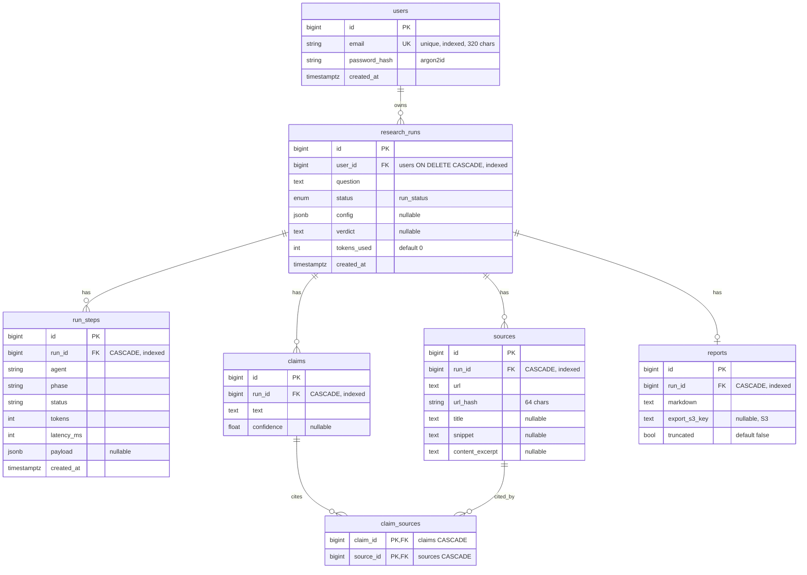

# Data Model

> The persistence schemas of both editions: the production PostgreSQL 7-table schema and the live
> Cloudflare D1 schema. Read from the source — [`db/models.py`](../apps/api/src/atlas_api/db/models.py)
> and [`apps/cloudflare/migrations/`](../apps/cloudflare/migrations/).

## Table of contents

- [PostgreSQL (production edition)](#postgresql-production-edition)
- [Table reference](#table-reference)
- [Notable design choices](#notable-design-choices)
- [Cloudflare D1 (live edition)](#cloudflare-d1-live-edition)
- [Why the two schemas differ](#why-the-two-schemas-differ)

## PostgreSQL (production edition)

Seven tables, SQLAlchemy 2.0 async, created by the Alembic baseline migration `0001_initial`
([`migrations/versions/`](../apps/api/src/atlas_api/migrations/versions/)). Entity relationships:

## Table reference

| Table | Purpose | Key columns & constraints |
|---|---|---|
| `users` | Accounts | `email` unique + indexed (320 chars); `password_hash` argon2id (255) |
| `research_runs` | One research/recovery run | `user_id` → `users` **ON DELETE CASCADE**, indexed; `question` **redacted on write** (PII masked before flush); `status` enum `run_status`; `config` jsonb (holds **`data_types`**, the leaked-data categories driving the breach playbooks); `verdict`; `tokens_used` |
| `run_steps` | Live agent tree + telemetry | `run_id` CASCADE, indexed; per-step `agent`/`phase`/`status`, `tokens`, `latency_ms`, `payload` jsonb |
| `sources` | Retrieved sources per run | `run_id` CASCADE, indexed; **`UNIQUE(run_id, url_hash)`** (`uq_sources_run_urlhash`) dedups within a run; `url`, `title`, `snippet`, `content_excerpt` |
| `claims` | Tracked, citable claims | `run_id` CASCADE, indexed; `text`, `confidence`; `relationship` to `claim_sources` (`cascade="all, delete-orphan"`) |
| `claim_sources` | Claim ↔ source join (M:N) | **composite PK `(claim_id, source_id)`**, both FKs CASCADE |
| `reports` | The final report | `run_id` CASCADE, indexed; `markdown`; `export_s3_key` (S3 export); `truncated` flag |

`RunStatus` enum (`run_status`) values: `queued`, `planning`, `searching`, `verifying`, `writing`,
`done`, `cancelled`, `failed`, `truncated`. All tables carry a `created_at timestamptz` via the
`TimestampMixin` except the join/leaf tables that don't need it (`sources`, `claims`,
`claim_sources`, `reports`).

## Notable design choices

- **PII redaction on write (`question`).** Both editions mask the breach description **before** it is
  persisted — `redact_pii()` runs in `RunRepository.create()` before the row is flushed
  ([`runs/repository.py`](../apps/api/src/atlas_api/runs/repository.py),
  [`security/redaction.py`](../apps/api/src/atlas_api/security/redaction.py)); the live Worker masks
  via `redactPII()`. The stored `question` is therefore already de-identified (emails, SSNs,
  Luhn-validated cards, phones → `[redacted-…]`); the model still received the original in-memory. The
  `report` is **not** redacted (it carries official hotline numbers). See
  [security §PII redaction](security.md#pii-redaction) and [`compliance.md`](compliance.md).
- **`data_types` persisted in `config`.** `RunCreateIn.data_types`
  ([`runs/schemas.py`](../apps/api/src/atlas_api/runs/schemas.py)) is stored on the run's `config`
  JSONB as `{"data_types": [...]}` and read back by the worker
  ([`worker.py`](../apps/api/src/atlas_api/worker.py)) to inject the matching breach playbooks into
  the graph — wired end to end on the production `POST /v1/runs` path.
- **`claim_sources` join table over an array.** Claims cite sources through a real M:N join with a
  composite primary key and CASCADE FKs, rather than an `int[]` of source ids — this preserves
  referential integrity (you can't cite a deleted source) and lets the DB enforce uniqueness.
- **In-DB source dedup.** `UNIQUE(run_id, url_hash)` makes "one source per URL per run" a database
  invariant, complementing the in-memory dedup the worker does while streaming.
- **CASCADE from `users` down.** Deleting a user cascades to their runs and everything under them —
  the structural basis for erasure/right-to-deletion. In production a self-service
  `DELETE /v1/runs/:id` endpoint and an automated retention purge are still **planned** (the live
  edition already ships both; see below). See
  [threat model](threat-model.md#7-data-privacy--pii-in-questions--logs-owasp-a08a09) and
  [`compliance.md`](compliance.md).
- **Defense-in-depth tenancy.** The repository layer filters every query by `user_id`
  ([`runs/repository.py`](../apps/api/src/atlas_api/runs/repository.py)); Postgres **Row-Level
  Security** on an `app.user_id` GUC is the planned backstop (not yet implemented).
- **`run_steps` is dual-purpose:** it is both the durable agent-execution telemetry and a fallback
  replay source for SSE reconnects beyond the Redis Stream retention window.
- **`pgvector` cross-run source caching** is explicitly deferred (Phase 2).

## Cloudflare D1 (live edition)

A much smaller SQLite schema, because the live edition runs a single Claude call rather than the
multi-node graph. Source: [`apps/cloudflare/migrations/`](../apps/cloudflare/migrations/).

`0001_init.sql`:

| Table | Columns |
|---|---|
| `runs` | `id` TEXT PK (UUID), `question`, `status` (default `queued`), `report`, `model`, `tokens` (default 0), `created_at` |
| `sources` | `id` INTEGER PK AUTOINCREMENT, `run_id` → `runs(id)` **ON DELETE CASCADE**, `url`, `title`, `snippet` |

Indexes: `idx_sources_run (run_id)`, `idx_runs_created (created_at DESC)`.

`0002_rate_limit.sql`:

| Table | Columns |
|---|---|
| `rate_limits` | `ip` TEXT, `day` TEXT, `count` INTEGER (default 0), **PK `(ip, day)`** |

`rate_limits` backs the per-IP / global daily denial-of-wallet caps; the Worker atomically bumps a
counter with `INSERT … ON CONFLICT(ip, day) DO UPDATE SET count = count + 1 RETURNING count`.

**Privacy controls on the D1 schema.** The stored `runs.question` is **redacted on write** —
`redactPII()` masks PII before the `INSERT`, while Claude receives the original text in-memory
([`src/index.ts`](../apps/cloudflare/src/index.ts)). A **30-day retention sweep** (Cloudflare cron
`"17 3 * * *"` → the Worker's `scheduled()` handler) deletes `runs` and their `sources` older than 30
days plus stale `rate_limits` rows, and `DELETE /api/runs/:id` performs self-service erasure of a run
and its sources. D1 does not enforce the `ON DELETE CASCADE` by default, so the purge and the delete
both remove `sources` explicitly before the parent `runs` row. See [`compliance.md`](compliance.md).

## Why the two schemas differ

The production schema models a **multi-step agent**: distinct nodes produce steps, sources, claims,
and a report, with citations as first-class relationships — so it needs `run_steps`, `claims`, and
the `claim_sources` join. The live edition produces a **single streamed report** with a flat list of
sources, so `runs` + `sources` (+ `rate_limits`) is sufficient. Both persist enough to render run
history and a cited report; only the production edition records the per-step execution trace.
